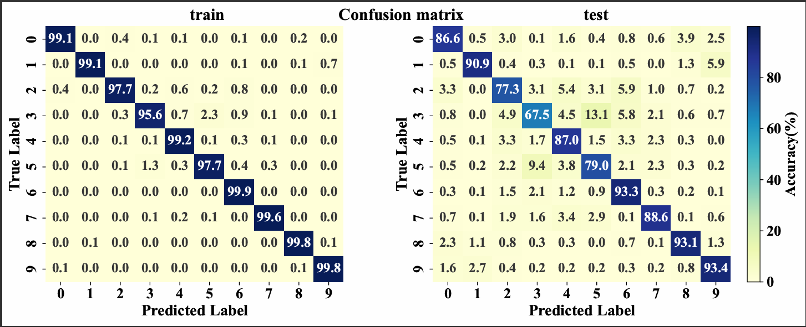

# CIFAR-10 Image Classification Project

Introduction:
The CIFAR-10 dataset is a well-known collection of images used for training machine learning models in image classification tasks. Comprising 60,000 32x32 color images across 10 different classes, CIFAR-10 serves as a benchmark for evaluating the performance of various algorithms in computer vision.
This Python project is designed to provide a comprehensive framework for working with the CIFAR-10 dataset, facilitating both data handling and model training. The project is organized into several components:

---

<strong>1. Utils</strong>

<strong>download_handle_data.py</strong>

This file contains functions for downloading and extracting CIFAR-10 dataset files.

## Functions

### `download_data(url)`
Downloads a `.tar.gz` file from a given URL and saves it locally.

- **Parameters**:
  - `url` (str): URL of the file to download.

- **Process**:
  - Checks if the `data` directory and the `.tar.gz` file already exist.
  - Downloads the file if it doesn't exist.

---

### `extract_cifar10_data(directory)`
Extracts the contents of the downloaded `.tar.gz` file into the specified directory.

- **Parameters**:
  - `directory` (str): Path to extract the contents of the `.tar.gz` file.

- **Process**:
  - Verifies the `.tar.gz` file exists.
  - Extracts the file into the provided directory.

---

## Class: `ConvertDataToImages`

This class handles the conversion of CIFAR-10 dataset batches from binary format to image files, organized into directories based on labels.

### Attributes:
- `labels_dict` (dict): Maps label indices to label names.
- `batch_data` (list): Holds image data for a batch.
- `batch_labels` (list): Holds the labels for images.
- `batch_filenames` (list): Holds filenames of images.
- `labels_names` (list): Stores label names from metadata.

---

### `__init__()`
Initializes the class with empty attributes for labels, data, and filenames.

---

### `load_label_names(meta_file_path)`
Loads the label names from a metadata file.

- **Parameters**:
  - `meta_file_path` (str): Path to the metadata file.

---

### `create_images_folder()`
Creates a directory structure for saving images based on their labels.

- **Process**:
  - Creates an `images` directory with subdirectories named after labels.

---

### `create_image_labels_to_string()`
Creates a dictionary mapping label indices to label names.

---

### `load_batch(file_path)`
Loads a batch of CIFAR-10 data.

- **Parameters**:
  - `file_path` (str): Path to the CIFAR-10 batch file.

---

### `convert_data_to_images(names_paths, end_file)`
Converts image data to images and saves them to the disk.

- **Parameters**:
  - `names_paths` (str): Path to save image names and labels.
  - `end_file` (int): Format indicator for saving labels.

---

### `run(batch_paths, names_paths, end_file)`
Executes the full conversion process: loads data, creates directories, and saves images.

- **Parameters**:
  - `batch_paths` (str): Path to the CIFAR-10 batch file.
  - `names_paths` (str): Path to save image names and labels.
  - `end_file` (int): Format indicator for saving labels.

- **Returns**:
  - `dict`: Mapping of label indices to label names.

---

<strong>load_patchs.py</strong>

This file defines functions for model creation, training, evaluation, and prediction using TensorFlow/Keras. It includes several deep learning models (custom CNN, MobileNetV2, VGG16), custom F1 score metric, and utilities for training multiple models and predicting using a trained model. 

## Functions:

### `load_paths_labels(path)`
Loads image paths and corresponding labels from a specified text file.

- **Parameters**:
  - `path` (str): File path to the text file containing image paths and labels.
- **Returns**:
  - `paths_labels` (list): List of image paths and labels.

---

### `handle_images_path_and_labels(paths_labels)`
Processes the paths and labels, generating a list of image paths and corresponding labels.

- **Parameters**:
  - `paths_labels` (list): List of image names and labels.
- **Returns**:
  - `paths` (list): List of processed image paths.
  - `labels` (list): List of corresponding image labels.

---

### `get_patch(paths, labels, patch_size)`
Yields patches of image paths and their labels based on the patch size.

- **Parameters**:
  - `paths` (list): List of image paths.
  - `labels` (list): List of corresponding image labels.
  - `patch_size` (int): The size of the patches to divide the data into.
- **Yields**:
  - Tuple of image paths and labels for each patch.

---

### `load_images_patch(paths)`
Loads a batch of images from the given list of paths and converts them to NumPy arrays.

- **Parameters**:
  - `paths` (list): List of image paths to load.
- **Returns**:
  - `images` (np.array): Array of loaded images.

---

### `read_image_labels(path, patch_size, image_shape)`
Reads image names and labels, then generates and preprocesses image patches in a TensorFlow dataset format.

- **Parameters**:
  - `path` (str): File path to the text file containing image paths and labels.
  - `patch_size` (int): The size of the patches to load.
  - `image_shape` (tuple): Shape of the images (height, width).
- **Returns**:
  - `dataset` (tf.data.Dataset): Preprocessed TensorFlow dataset ready for training.

---

### `extract_labels(dataset)`
Extracts labels and images from the TensorFlow dataset.

- **Parameters**:
  - `dataset` (tf.data.Dataset): The TensorFlow dataset containing images and labels.
- **Returns**:
  - `images` (np.array): Array of images from the dataset.
  - `labels` (np.array): Array of corresponding labels from the dataset.

---

<strong>model_training_testing.py</strong>

This file defines functions for model creation, training, evaluation, and prediction using TensorFlow/Keras. It includes several deep learning models (custom CNN, MobileNetV2, VGG16), custom F1 score metric, and utilities for training multiple models and predicting using a trained model. 

---

## Functions:

### `custom_f1_score(y_true, y_pred)`
Custom function for calculating F1 score using Keras backend operations. It rounds predictions, calculates precision and recall, and then computes the F1 score.

- **Parameters**:
  - `y_true`: Ground truth labels.
  - `y_pred`: Predicted labels.
- **Returns**:
  - `f1`: The computed F1 score.

---

### `train_and_evaluate_models(models_list, train_dataset, validation_dataset, epochs, batch_size, final_model, l_r=.001, mome=.9)`
Trains a list of models and evaluates their performance on a validation dataset. Optionally returns the best-performing model.

- **Parameters**:
  - `models_list` (list): List of Keras models to be trained.
  - `train_dataset` (tf.data.Dataset): Dataset for training.
  - `validation_dataset` (tf.data.Dataset): Dataset for validation.
  - `epochs` (int): Number of epochs.
  - `batch_size` (int): Batch size.
  - `final_model` (bool): Whether to return the best model.
  - `l_r` (float): Learning rate (default is 0.001).
  - `mome` (float): Momentum (default is 0.9).
- **Returns**:
  - If `final_model` is `True`: Returns the best trained model and training history.
  - Else: Returns a dictionary with model names and their validation accuracy.

---

### `predict(prediction_model, test_dataset)`
Makes predictions using a trained model and evaluates performance using accuracy and F1 score.

- **Parameters**:
  - `prediction_model`: Trained model to use for prediction.
  - `test_dataset` (tf.data.Dataset): Test dataset.
- **Returns**:
  - `model_acc` (float): Accuracy score.
  - `model_f1` (float): F1 score.
  - `predictions` (np.array): Predicted labels.
  - `labels` (np.array): True labels.

---

## Model Definitions:

### `model_1()`
Defines a custom Convolutional Neural Network (CNN) with several Conv2D, MaxPooling, Dropout, and Dense layers. The final layer has 10 outputs for classification.

- **Returns**:
  - `model` (tf.keras.Model): A compiled CNN model.

---

### `model_2(image_shape, class_len=10)`
Defines a model based on the pre-trained MobileNetV2. The model uses transfer learning with a custom classification head.

- **Parameters**:
  - `image_shape` (tuple): Input image shape.
  - `class_len` (int): Number of output classes (default is 10).
- **Returns**:
  - `clf` (tf.keras.Model): A compiled MobileNetV2 model with custom layers.

---

### `model_3(image_shape, class_len=10)`
Defines a model based on the pre-trained VGG16. Similar to `model_2`, this uses transfer learning with a custom classification head.

- **Parameters**:
  - `image_shape` (tuple): Input image shape.
  - `class_len` (int): Number of output classes (default is 10).
- **Returns**:
  - `clf` (tf.keras.Model): A compiled VGG16 model with custom layers.

<strong>plotting.py</strong>

## Summary of Functions

1. **show_images(images_patch, labels)**
   - **Purpose**: Displays a grid of images with corresponding labels.
   - **Parameters**:
     - `images_patch`: A collection of image arrays to display.
     - `labels`: Labels corresponding to each image in `images_patch`.
   - **Functionality**:
     - The function calculates the number of images per row and column, creates a grid, resizes images, and displays them with the class labels as titles.

2. **plot_accuracy(epoch, history, string="Validation")**
   - **Purpose**: Plots the accuracy and loss for both training and validation over epochs.
   - **Parameters**:
     - `epoch`: Total number of epochs.
     - `history`: History object returned by the model training process.
     - `string`: Custom label for the validation metrics.
   - **Functionality**:
     - Generates two plots: one for accuracy and one for loss, showing the metrics for training and validation data over time.

3. **plot_combined_confusion_heat_map(y_train_act, y_train_pred, y_test_act, y_test_pred, str6="")**
   - **Purpose**: Generates side-by-side confusion matrix heatmaps for training and test datasets.
   - **Parameters**:
     - `y_train_act`: Actual labels for the training set.
     - `y_train_pred`: Predicted labels for the training set.
     - `y_test_act`: Actual labels for the test set.
     - `y_test_pred`: Predicted labels for the test set.
     - `str6`: A custom string for labeling.
   - **Functionality**:
     - Produces two heatmaps showing normalized confusion matrices for both training and test datasets, and saves the plot as a PDF.

 

<strong> 2. Models </strong>

### Model Outputs and Results

This folder contains the output models and results from the training process, both in **H5** and **Keras** formats, which can be loaded when needed. 

We trained three models, but the best-performing model is **Model 1**.

### Model Architecture Overview

#### **Model 1: Convolutional Neural Network (CNN)**

A deep convolutional neural network that incorporates several convolutional layers, batch normalization, and dropout for regularization.

- **Architecture**:
- Input (32x32x3)
- Conv2D (32 filters, 3x3, ReLU) 
- BatchNormalization
- Conv2D (32 filters, 3x3, ReLU) 
- BatchNormalization ↓ MaxPool2D (2x2) 
- Dropout (20%) ↓ Conv2D (64 filters, 3x3, ReLU) 
- BatchNormalization 
- Conv2D (64 filters, 3x3, ReLU) 
- BatchNormalization 
- MaxPool2D (2x2) 
- Dropout (30%) 
- Conv2D (128 filters, 3x3, ReLU) 
- BatchNormalization 
- Conv2D (128 filters, 3x3, ReLU)
- BatchNormalization
- MaxPool2D (2x2) 
- Dropout (40%) 
- Flatten 
- Dense (128, ReLU) 
- BatchNormalization 
- Dropout (50%) 
- Output (10 classes, Softmax)

---

**Model 2: MobileNetV2**
A lightweight model that leverages depthwise separable convolutions to minimize the number of parameters while maintaining performance.

- Input (32x32x3)

- MobileNetV2 (pre-trained on ImageNet)

- GlobalAveragePooling2D

- Dense (512, ReLU)

- Output (10 classes, Softmax)

---

**Model 3: VGG16**
A classic deep learning model known for its simplicity and depth, which has shown great performance in various tasks.

architecture:

- Input (32x32x3)
- VGG16 (pre-trained on ImageNet)
- GlobalAveragePooling2D
- Output (10 classes, Softmax)

 
<strong>3. Notebooks</strong>
  

1. **`download_handle_data`**: Handles downloading and extracting the CIFAR-10 dataset into images using the utility scripts.
2. **`train_test_data`**: Used for training the models, selecting the best-performing one, testing, and generating coverage reports. 

<strong>4. results</strong>

## Model Performance

- **Accuracy**: 0.8567  
- **F1-Score**: 0.8557  

### Classification Report:
| Label      | Precision | Recall  | F1-Score | Support |
|------------|-----------|---------|----------|---------|
| Airplane   | 0.89      | 0.87    | 0.88     | 1000    |
| Automobile | 0.95      | 0.91    | 0.93     | 1000    |
| Bird       | 0.81      | 0.77    | 0.79     | 1000    |
| Cat        | 0.78      | 0.68    | 0.72     | 1000    |
| Deer       | 0.81      | 0.87    | 0.84     | 1000    |
| Dog        | 0.78      | 0.79    | 0.79     | 1000    |
| Frog       | 0.83      | 0.93    | 0.88     | 1000    |
| Horse      | 0.91      | 0.89    | 0.90     | 1000    |
| Ship       | 0.92      | 0.93    | 0.92     | 1000    |
| Truck      | 0.89      | 0.93    | 0.91     | 1000    |

- **Overall Accuracy**: 0.86  
- **Macro Average**: 0.86  
- **Weighted Average**: 0.86  

### Confusion Matrix:

For a visual representation, refer to the confusion matrix image: .

<strong>5. GUI &deployment on huggingface</strong>

A Gradio GUI provides a user-friendly interface to deploy the model and visualize the output. It displays an interactive histogram showing the percentage distribution of each class and highlights the predicted class. You can try the model on Hugging Face [**here**](https://huggingface.co/spaces/abdulrahman245/CIFAR-10).

### 1.GUI 

### 2.Classify a deer

### 3.Classify a car as automobile (main class of cars)

